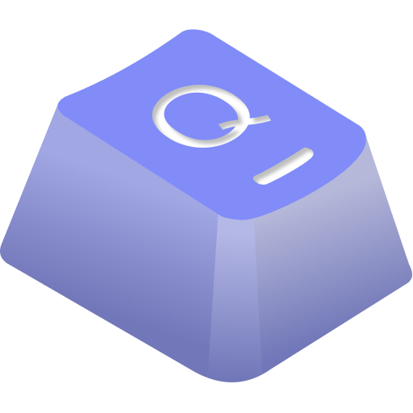

<div align=center>

</div>

<h1 align="center">
 Words Learner VSCode
</h1>

<div align=center>

</div>

## 💡 演示

<div align=center>

</div>

## 📸 安装

本项目为 [Words Learner](https://github.com/lslab/words-learner) 的 VSCode 插件版本，访问原始项目获得更好的体验。

（注：依赖 VSCode 最低版本为 1.53.0，如提示 ` it is not compatible with the current version of VS Code` 请升级 VSCode 版本）

## 🎛 使用说明

### 一键启动

**Mac** `Control + Shift + Q`

**Win** `Shift + Alt + Q`

可以在任意文档中使用快捷键启动，启动后插件将屏蔽用户对文档的输入，只需关注状态栏上的单词即可。

**⚠️ 切记需关闭中文输入法**，目前插件在开启中文输入法会有 Bug，待修复

### 章节、词典选择

打开 VSCode 命令面板，通过 “Words” 前缀过滤，即可发现插件内置的命令。

<div align=center>

</div>

- Change Chapter 可以切换章节
- Change Dictionary 可以切换字典
- Start/Pause 可以开关插件，功能等价于一键启动快捷键

命令面板快捷键  
Mac: `cmd + shift + p`  
Win: `ctrl + shift + p`

### 进阶配置

可以在设置面板查找关键字 “Words” 修改设置

```
"words-learner.highlightWrongColor": {
  "type": "string",
  "default": "#EE3D11",
  "description": "输入错误时单词的颜色"
},
"words-learner.highlightWrongDelay": {
  "type": "number",
  "default": 400,
  "description": "输入错误时清空输入的延迟时间"
},
"words-learner.keySound": {
  "type": "boolean",
  "default": true,
  "description": "是否开启键盘音"
},
"words-learner.phonetic": {
  "type": "string",
  "enum": [
    "us",
    "uk",
    "close"
  ],
  "default": "close",
  "description": "是否开启音标"
},
"words-learner.chapterLength": {
  "type": "integer",
  "default": 20,
  "minimum": 1,
  "maximum": 100,
  "description": "每个章节包含的单词数量"
},
"words-learner.reWrite": {
  "type": "boolean",
  "default": false,
  "description": "是否开启罚抄模式"
},
"words-learner.voiceType": {
  "type": "string",
  "enum": [
    "us",
    "uk",
    "close"
  ],
  "default": "us",
  "description": "是否开启发音"
},
```

## 📕 词库列表

- CET-4
- CET-6
- GMAT
- GRE
- IELTS
- 考研
- 专四
- 专八
- 高考 3500 词
- SAT
- TOEFL
- 商务英语
- BEC
- Coder Dict
- JS: Array
- JS: Date
- JS: Global
- JS: Map & Set
- JS: Math
- JS: Number
- JS: Object
- JS: Promise
- JS: String
- Python: Built-in
- Python: array
- Python: date
- Python: file
- Python: class
- Python: set
- Python: math
- Python: string
- Python: system
- Java: ArrayList
- Java: Character
- Java: Hashmap
- Java: LinkedList
- Java: String
- Java: StringBuffer
- Linux
- C#: List API
- 新概念英语-1
- 新概念英语-2
- 新概念英语-3
- 新概念英语-4
- SAT en-en
- Essential Words
- Essential Words
- suffix word
- word roots1
